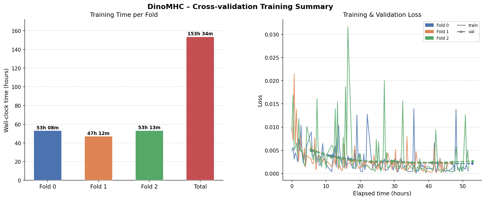

<h1 align="center">🦖 DinoMHC</h1>
<p align="center"><a href="#">📝 Paper (Update soon!)</a> | <a href="https://doi.org/10.5281/zenodo.20491231">🗂️ Datasets</a> |  <a href="https://1drv.ms/u/c/fa72f5f3c0e55162/IQDrYl8gFdD7TqZFpeQB3kXyAbspSezf8e-_Jmc5NlIz1pY">🏋️‍♂️ Model weights</a> | <a href="https://balalab-skku.org/">🚀 Webserver (Update soon!)</a> | <a href="#">📚 Cite our paper!</a></p>

The official implementation of manuscript **DinoMHC: An interpretable sequence-geometric framework improves MHC-I presentation prediction and transfers CD8+ T-cell immunogenicity**

## News
- Update soon!

## Abstract
> Update soon!

## Environment installation

Create an environment using Miniconda or Conda:
```zsh
conda create -n dinomhc python=3.10
conda activate dinomhc
```

After cloning the repo, run the following command to install required packages:
```zsh
python -m pip install -r requirements.txt --no-cache-dir

```

## Training model
```zsh
usage: train.py [-h] [--config CONFIG] [--fold FOLD] [--train_all_folds] [--resume_from_checkpoint] [--verbose]

Train DinoMHC for pMHC-I Presentation Prediction

options:
  -h, --help            show this help message and exit
  --config CONFIG       Path to YAML config file (default: configs/default.yaml)
  --fold FOLD           Fold index to use (0-4) (default: 0)
  --train_all_folds     Train on all 5 folds sequentially (default: False)
  --resume_from_checkpoint
                        Path to checkpoint to resume training from (default: False)
  --verbose             Enable verbose logging (default: False)
```

To train the original DinoMHC's settings, run the following command:
```zsh
python train.py --config configs/dinomhc_full_model_8gpus.yaml \ 
                --train_all_folds \
                --verbose
```

## Inferencing model
```zsh
usage: test.py [-h] --checkpoints CHECKPOINTS [CHECKPOINTS ...] --benchmark_dataset BENCHMARK_DATASET [--output OUTPUT] --model_config MODEL_CONFIG [--threshold THRESHOLD] [--batch_size BATCH_SIZE] [--num_workers NUM_WORKERS] [--device DEVICE] [--device_id DEVICE_ID] [--calculate_by_allele]
               [--centroid_target_length CENTROID_TARGET_LENGTH] [--n_anchors N_ANCHORS]

Run testing on benchmark datasets the DinoMHC model

options:
  -h, --help            show this help message and exit
  --checkpoints CHECKPOINTS [CHECKPOINTS ...]
                        Paths to the model checkpoint files for each fold (default: None)
  --benchmark_dataset BENCHMARK_DATASET
                        Path to the benchmark dataset file (CSV format) (default: None)
  --output OUTPUT       Directory to save the evaluation results (default: results/)
  --model_config MODEL_CONFIG
                        Path to the model configuration file (YAML format) (default: None)
  --threshold THRESHOLD
                        Threshold for binary classification when evaluating predictions (default: 0.5)
  --batch_size BATCH_SIZE
                        Batch size for evaluation (default: 32)
  --num_workers NUM_WORKERS
                        Number of worker processes for data loading (default: 4)
  --device DEVICE       Device to run the evaluation on (e.g., 'cuda' or 'cpu') (default: cuda)
  --device_id DEVICE_ID
                        GPU device ID to use if running on CUDA (default: 0)
  --calculate_by_allele
                        Whether to calculate evaluation metrics separately for each MHC allele (default: False)
  --centroid_target_length CENTROID_TARGET_LENGTH
                        Length to trim peptides to if they exceed the max supported length. (default: 9)
  --n_anchors N_ANCHORS
                        Number of N-terminal anchors to preserve during centroid trimming. (default: 4)
```

To reproduce the work in our paper, run the following command:
```zsh
python test.py --checkpoints weights/DINOMHC_WEIGHTS/fold_0/ weights/DINOMHC_WEIGHTS/fold_1/ weights/DINOMHC_WEIGHTS/fold_2/ \ 
               --benchmark_dataset datasets/MS/TEST.csv \ 
               --output results/TEST \
               --model_config weights/DINOMHC_WEIGHTS/model_config.yaml \ 
               --device cuda \
               --calculate_by_allele
```

## Hardware specifications
DinoMHC was trained using DeepSpeed ZeRO, distributically trained on:
| Component | Specification |
|-----------|---------------|
| GPU | NVIDIA A100 80 GB (8 devices) |
| CPU | AMD EPYC 9554 (64 cores) |
| RAM | 128 GB |
| Operating System | Ubuntu 22.04 |

## Total training time


## Datasets & model weights

To download all datasets used in our paper, please refer to: [Zotero](https://doi.org/10.5281/zenodo.20491231)

To download trained model weights, please refer to: [OneDrive](https://1drv.ms/u/c/fa72f5f3c0e55162/IQDrYl8gFdD7TqZFpeQB3kXyAbspSezf8e-_Jmc5NlIz1pY)

## Protein Language Model (PLM) Comparison
| PLM | Throughput (samples)/s ⬆️ | Latency/sample (ms) ⬇️ | Peak GPU memory (GB) ⬇️ |
|-----------|---------------|---------------|---------------|
| ESM-2  |**60.08** | **16.6447**|**2.6822**|
| ESM-1 | 51.34| 19.4763|4.5897|
| ProtT5 |39.01 |25.6328|6.6318|
| ProtBERT | 57.67| 17.3413|3.6955|
| ProtXLNet |41.55 |24.0662 |3.6543|


## Cite
```
Update soon!
```